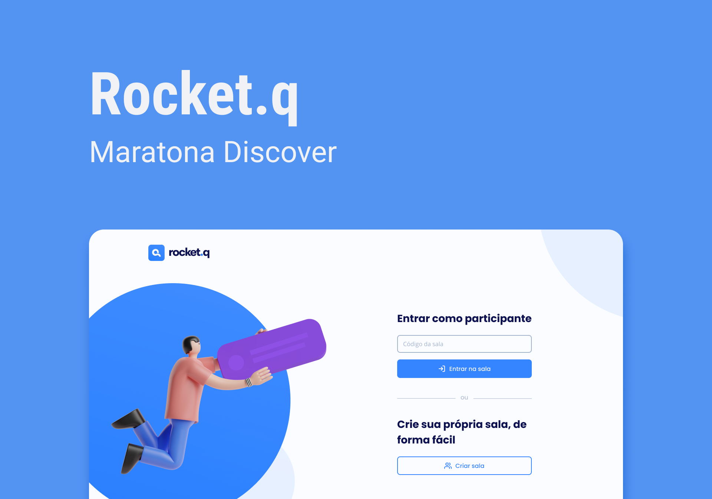

<h1 align="center">
  
</h1>

  

 

 

  

## ✨ Tecnologias

Esse projeto foi desenvolvido com as seguintes tecnologias:

- ...

## 💻 Projeto

Um site para criar salas e fazer perguntas de forma anônima.

## 🔖 Layout

Você pode visualizar o layout do projeto através [desse link](https://www.figma.com/file/vp3iFfd1ohCbHyDX9jCiQi/Roquet.q-%2302/duplicate). É necessário ter conta no [Figma](http://figma.com/) para acessá-lo.

## 🚀 Como executar

- Clone o repositório
- 

## 📄 Licença

Esse projeto está sob a licença MIT. Veja o arquivo [LICENSE](LICENSE.md) para mais detalhes.

